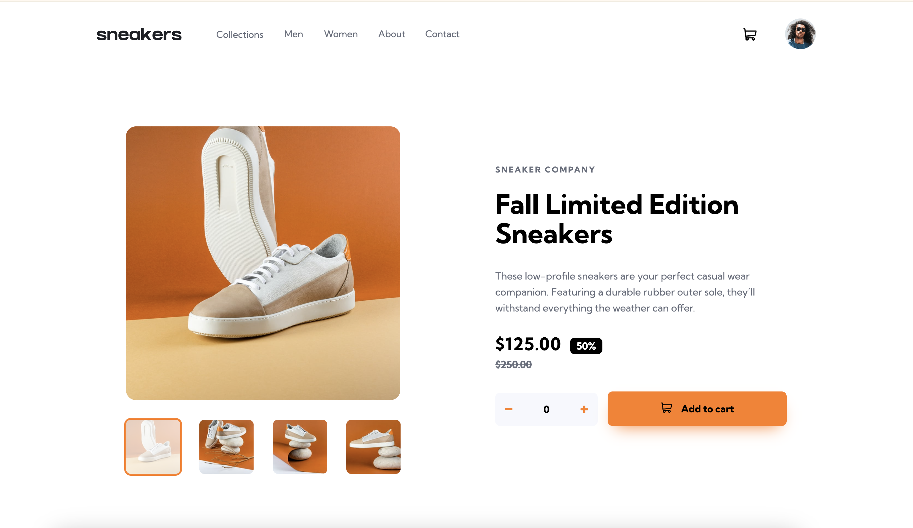

# Frontend Mentor - E-commerce product page solution

This is a solution to the [E-commerce product page challenge on Frontend Mentor](https://www.frontendmentor.io/challenges/ecommerce-product-page-UPsZ9MJp6). Frontend Mentor challenges help you improve your coding skills by building realistic projects.

## Table of contents

- [The challenge](#the-challenge)
- [Screenshot](#screenshot)
- [Links](#links)
- [Built with](#built-with)
- [What I learned](#what-i-learned)

### Screenshot

### Links

- Solution URL: [https://github.com/tunaerten/e-commerce-product-page]
- Live Site URL: [https://e-commerce-product-erten.netlify.app/]

## My process

### Built with

- Semantic HTML5 markup
- CSS custom properties
- Flexbox
- CSS Grid
- Mobile-first workflow
- JavaScript

### What I learned

This was quite a long project that took me about a month to complete. Unfortunately, due to holidays and my workload, I couldn't dedicate as much time as I wanted, but I'm happy to have finished it in the end. The HTML and CSS parts were fairly straightforward. In JavaScript, I spent the most time on the lightbox. Initially, I wanted to use the same lightbox element for the mobile view, but when I couldn't make it work, I ended up planning it as a separate element.

Additionally, instead of creating a product with only static text, I structured it as an array to make it appear as if the product data came from an API. I defined all the information there, which allowed me to reuse and modify the same variables across multiple places.

As for features outside the original project plans, I developed a system where items are dynamically added and removed instead of just using a standalone trash bin. (I noticed this approach is common in many e-commerce sites.) Also, items added to the shopping cart disappear after a certain period but reappear when you hover over the cart icon.

Initially, I planned to add a dark mode as well, but I decided to skip it because I wanted to finish the project. Maybe I'll implement it in my next project.
